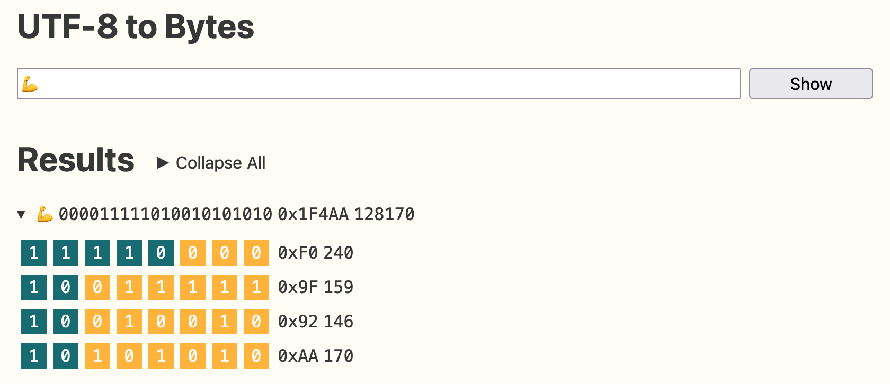

# UTF-8 to Bytes

A webpage that displays a UTF-8 strings as individual bytes.



Inspired by [Bytes: The Lesser-Known Python Built-In Sequence • And Understanding UTF-8 Encoding](https://www.thepythoncodingstack.com/p/bytes-python-built-in-unicode-utf-8-encoding) by Stephen Gruppetta.

## Development

Run a PHP static web server and then access [http://localhost:8000](http://localhost:8000):

```
php -S localhost:8000  
```

## Notes

I used this project as chance to use modern web development practices:

- CSS Layers, Nesting, Grid, Flexbox, Has and Variables
- JS Importmaps
- Web Components

## Todos

- [ ] Improve layout on mobile.

## Resources

- [Bytes: The Lesser-Known Python Built-In Sequence • And Understanding UTF-8 Encoding](https://www.thepythoncodingstack.com/p/bytes-python-built-in-unicode-utf-8-encoding)
- [ASCII And UTF-8 to Binary](https://www.rapidtables.com/convert/number/ascii-to-binary.html)
- [ASCII And UTF-8 Chart](https://design215.com/toolbox/ascii-utf8.php)
- [Codepoints](https://codepoints.net/)